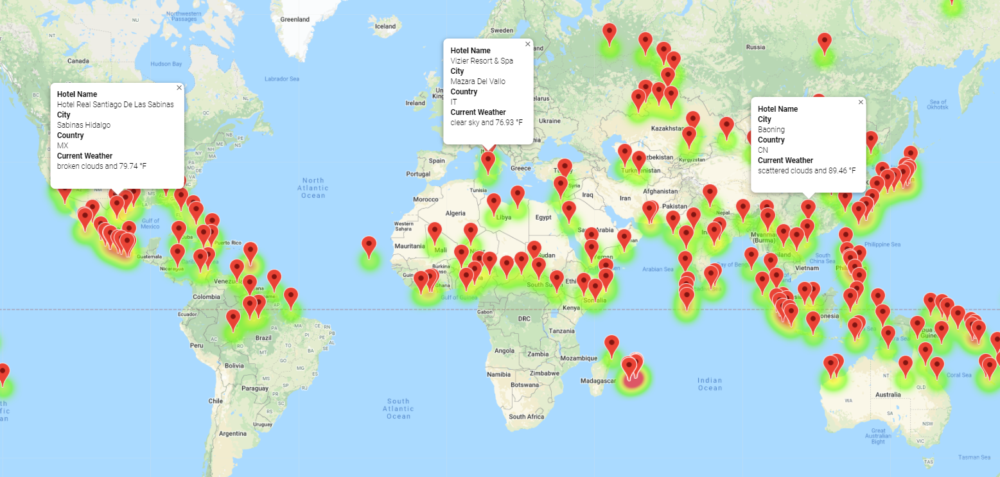
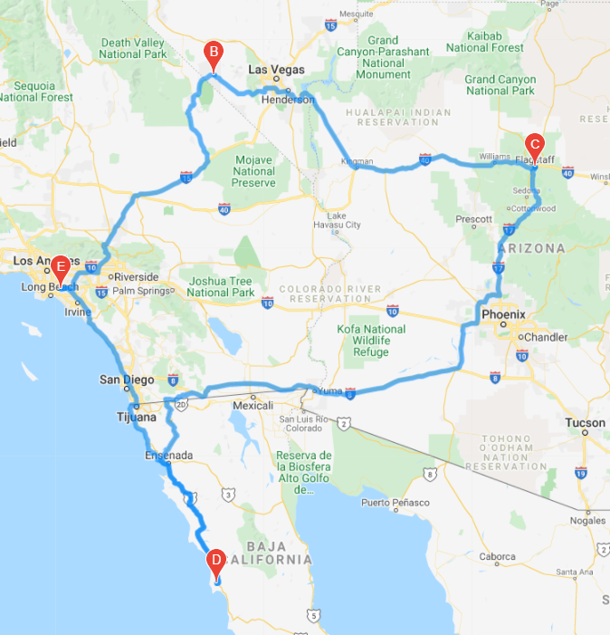
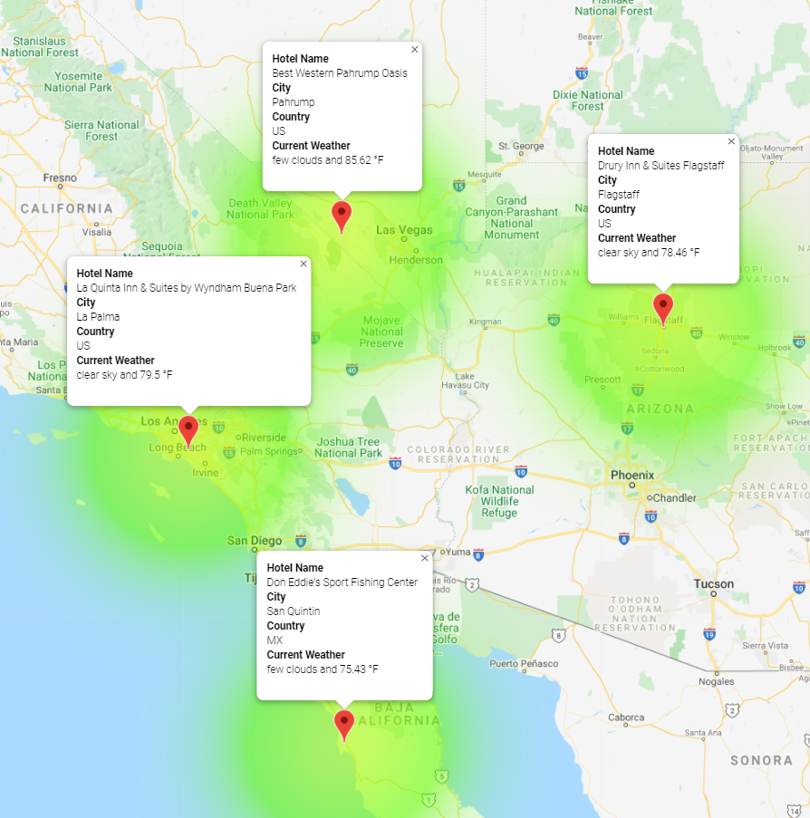

# World Weather Analysis

## Overview of World Weather Analysis
Plan My Trip is a top travel technology company that specialized in internet related services in the hotel and lodging industry. I collected and analyzed weather data across cities worldwide. I created a Pandas DataFrame with 600 or more of the world's unique cities and their weather data in real time. The analysis will help Plan My Trip recommend ideal hotels based on their clients' weather preferences. 

Please see the three folders that offer different levels of analysis: 
1. Weather_Database
2. Vacation_Search
3. Vacation_Itinerary

## Weather_Database 
This folder contains data on over 600 different cities around the world. I used NumPy to generat more than 1,500 random ltitudes and longitudes. Then using the Open Weather Map API, I pulled weather information on the different cities around the world. That information consists of:

1. City, country, and date
2. Latitude and longitude
3. Maximum temperature
4. Humidity
5. Cloudiness
6. Wind speed
7. Current Weather Description

These seven different categories of information help travelers to choose their ideal hotels based on their weather preferences. 

## Vacation_Search
In the Vacation_Search folder, we are using weather database and Google Maps API to search and locate travel destinations with hotels in location that match a customer's weather preference. The script prompts the customer to specify their minimum and maximum temperature preferences on vacation. Then it will create a new DataFrame based on the temperature preference and retrieve hotel names. 

I then created a marker layer map that has a pop-up marker for cities containing information on the following: 

1. Hotel Name
2. City 
3. Country
4. Current weather description with the maximum temperature. 

## Vacation_Itinerary
In the Vacation_Itinerary, I am picking four vacations stops to create an itinerary that matches a client's weather preference. Using Google Maps direction API, I am able to create a travel itinerary and show the driving route. The four cities are La Palma, Pahrump, Flagstaff, and San Quintin. 

I also created a marker layer map that has a pop-up marker for cities containing information on the following: 

1. Hotel Name
2. City 
3. Country
4. Current weather description with the maximum temperature. 

## Extra: weather_data
This folder contains scatter plots looking at different weather information compared to city latitude. I plot the following weather information vs city latitude: 

1. City Latitude vs. Max Temperature
2. City Latitude vs. Humidity
3. City Latitude vs. Cloudiness (%)
4. City Latitude vs. Wind Speed

Extra: Please see script WeatherPy.IPYNB to see linear regression models on the four weather information scatter plots by Northern and Southern Hemisphere.

